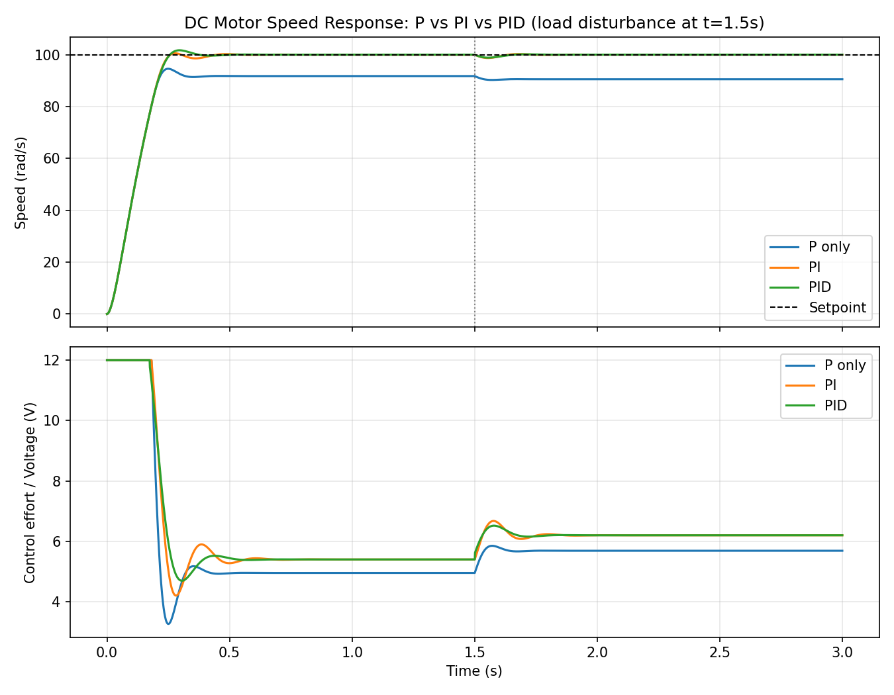

# PID Speed Controller for a DC Motor

A from-scratch simulation of closed-loop speed control for a brushed DC motor, built to compare P, PI, and PID tuning under a load disturbance. No control-toolbox black boxes — the motor's electrical and mechanical equations are integrated directly so every line of the control loop is visible and easy to modify.

## Why this project

Automation systems live or die on control loops: a motor, sensor feedback, and a controller deciding the next command. This project builds that loop from the physics up — motor model, controller, actuator saturation, anti-windup — the same pattern used in robotics, drives, and industrial process control.

## What it does

- Models a DC motor from its electrical and mechanical differential equations (armature current, back-EMF, inertia, friction).
- Implements a PID controller with output saturation and anti-windup (integral only accumulates when the output isn't clipped).
- Runs three tunings — P only, PI, and full PID — against the same 100 rad/s speed setpoint.
- Injects a load-torque disturbance mid-simulation to show how each controller rejects it.
- Reports settling time, overshoot, and steady-state error for each.

## Results



| Controller | Settling time (s) | Overshoot (%) | Steady-state error (rad/s) |
|---|---|---|---|
| P only | 3.00 | 0.0 | 9.48 |
| PI | 0.24 | 0.5 | 0.00 |
| PID | 0.24 | 1.7 | 0.00 |

This is the textbook result: a pure proportional controller always leaves steady-state droop under load, adding the integral term drives that error to zero, and the derivative term trades a touch of overshoot for faster disturbance rejection.

## Run it

```bash
pip install numpy matplotlib
python pid_motor_sim.py
```

## Files

- `pid_motor_sim.py` — motor model, PID controller, simulation loop, and plotting.
- `pid_response.png` — generated output (speed response + control effort).

## Possible extensions

- Swap the Euler integrator for `scipy.integrate.solve_ivp` for stiffer systems.
- Add sensor noise and a discrete-time controller running at a realistic sample rate.
- Auto-tune gains with Ziegler-Nichols or a simple optimizer.
