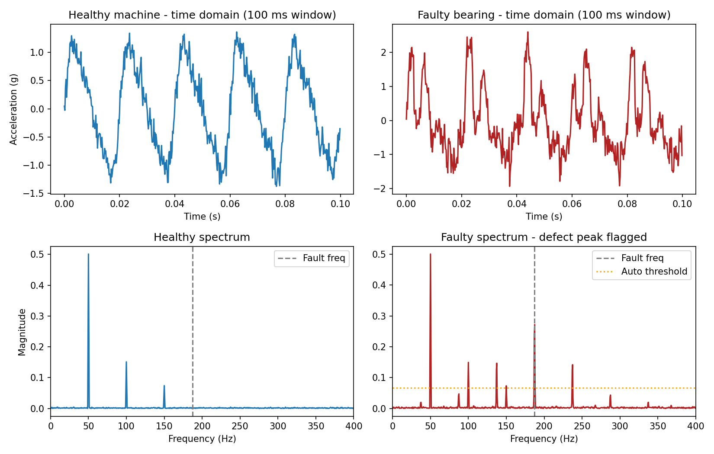

# Predictive Maintenance via FFT-Based Vibration Analysis

An automated fault-detection pipeline that listens to simulated accelerometer data from a rotating machine and flags a developing bearing fault by its frequency signature — the same core technique (envelope/FFT analysis) used in real industrial condition-monitoring hardware.

## Why this project

Automation isn't just controlling actuators — it's also automating *decisions*. This project takes raw sensor data, runs a standard DSP pipeline (windowing + FFT), and turns it into an automatic pass/fail health verdict with no human looking at a waveform. That decision could drive an alert, a maintenance ticket, or a relay cutoff in a real deployment.

## What it does

- Generates two synthetic vibration signals: a healthy machine (shaft rotation harmonics + sensor noise) and a faulty one (same harmonics, plus the amplitude-modulated impact signature of an outer-race bearing defect).
- Computes the FFT of each (Hanning-windowed, correctly normalized).
- Estimates a statistical noise floor from a clean region of the spectrum and derives an automatic detection threshold (mean + 6σ) rather than a hardcoded magic number.
- Checks for a peak above that threshold at the known fault frequency and prints a diagnosis.

## Results

```
Healthy unit : peak=0.0027  threshold=0.0066  -> OK
Test unit    : peak=0.2717  threshold=0.0666  -> FAULT DETECTED
```



The healthy spectrum shows only the shaft rotation harmonics (50/100/150 Hz). The faulty unit shows the same harmonics plus a clear peak at 187.3 Hz — the bearing's characteristic defect frequency — well above the automatically computed noise floor.

## Run it

```bash
pip install numpy matplotlib
python fault_detection.py
```

## Files

- `fault_detection.py` — signal generation, FFT pipeline, automated diagnosis, and plotting.
- `fault_spectrum.png` — generated time-domain and frequency-domain comparison.

## Possible extensions

- Replace synthetic signals with a real accelerometer log (e.g. from an MPU6050 on a test rig) for a hardware-validated version.
- Add envelope analysis (Hilbert transform) for lower-SNR real-world data.
- Track the fault-frequency peak over many readings to trend degradation over time, not just flag a binary state.
