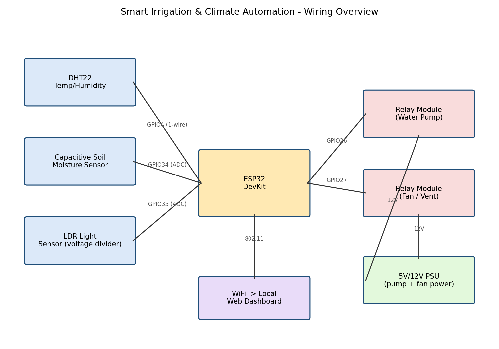

# Smart Irrigation & Climate Automation System (ESP32)

An ESP32-based embedded automation system that monitors soil moisture, temperature, humidity, and light, then autonomously drives a water pump and a ventilation fan — with hysteresis control, a runtime safety cutoff, and a live web dashboard.

## Why this project

This is closed-loop automation at the hardware/firmware level: sensors feed a decision layer, the decision layer drives real actuators through relays, and the whole thing runs unattended with a safety net. It's the embedded counterpart to the PID and DSP projects in this portfolio — same "sense -> decide -> act" pattern, implemented on real microcontroller I/O instead of in simulation.

## Hardware

| Component | Connection |
|---|---|
| ESP32 DevKit | Main controller |
| DHT22 (temp/humidity) | GPIO4 |
| Capacitive soil moisture sensor | GPIO34 (ADC) |
| LDR light sensor (voltage divider) | GPIO35 (ADC) |
| Relay module -> water pump | GPIO26 |
| Relay module -> fan/vent | GPIO27 |
| 5V/12V PSU | Powers pump + fan through the relays |

## Automation logic

- **Irrigation**: pump turns on when soil moisture drops below 30%, and stays on until it recovers past 55% — a hysteresis band, not a single threshold, so the pump doesn't chatter on/off right at the edge.
- **Climate**: fan turns on above 29°C and off below 26°C, same hysteresis idea.
- **Safety cutoff**: the pump is force-stopped after 30 seconds regardless of sensor reading, so a stuck sensor or a burst line can't run it indefinitely.
- **Manual override**: a toggle on the web dashboard pauses automation for maintenance/testing without reflashing firmware.

## Dashboard

The ESP32 hosts a small built-in web server showing live temperature, humidity, soil moisture, light level, and relay states, auto-refreshing every 5 seconds, with a manual-override toggle link.

## Files

- `firmware/smart_automation.ino` — full firmware: sensor reads, hysteresis automation logic, safety cutoff, WiFi web dashboard.
- `wiring/wiring_diagram.png` — connection overview.
- `wiring/draw_wiring.py` — script that generated the diagram (regenerate/edit if you change the pinout).

## Flashing it

1. Install the ESP32 board package in Arduino IDE (or PlatformIO) and the `DHT sensor library` (Adafruit).
2. Fill in `WIFI_SSID` / `WIFI_PASS` in `smart_automation.ino`.
3. Select your ESP32 board + port, upload.
4. Open the Serial Monitor at 115200 baud to grab the dashboard IP address once it connects.

## Possible extensions

- Log readings to InfluxDB/Google Sheets over HTTP for historical trends.
- Add a soil-moisture-calibration routine (dry-air / wet-water two-point calibration) instead of hardcoded ADC values.
- Swap the polling loop for interrupt-driven sensor reads and deep-sleep between cycles for battery operation.
